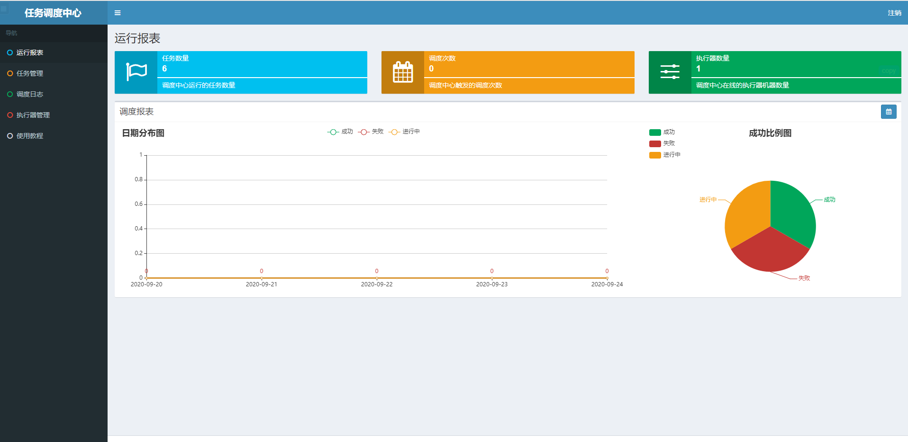
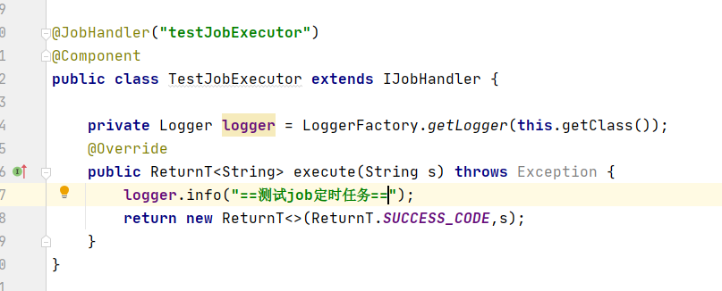
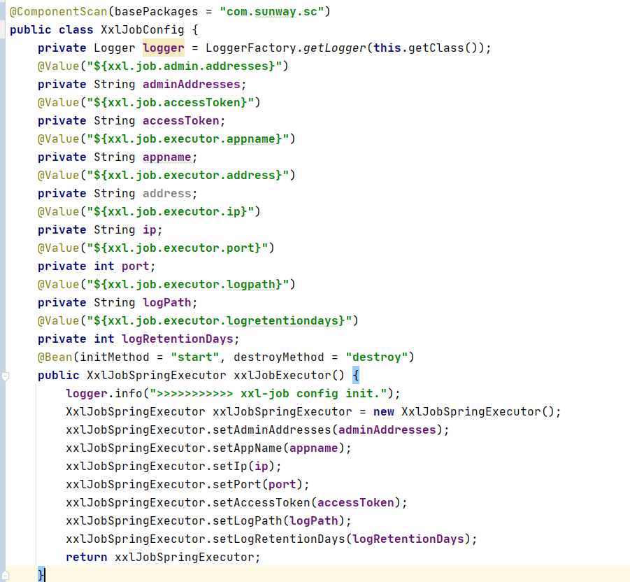
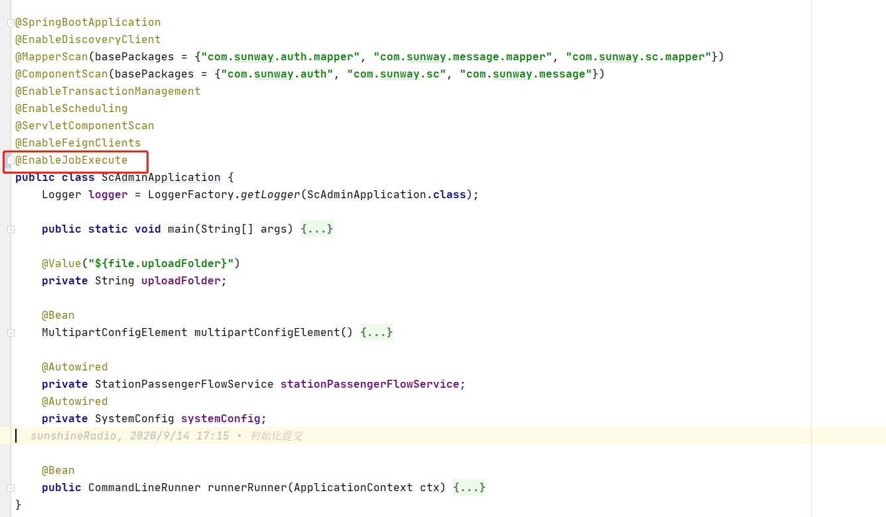
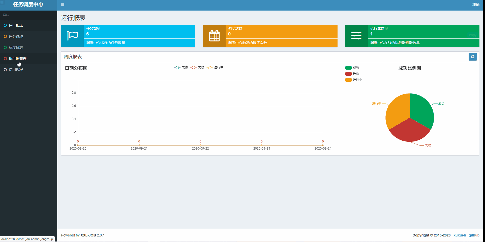
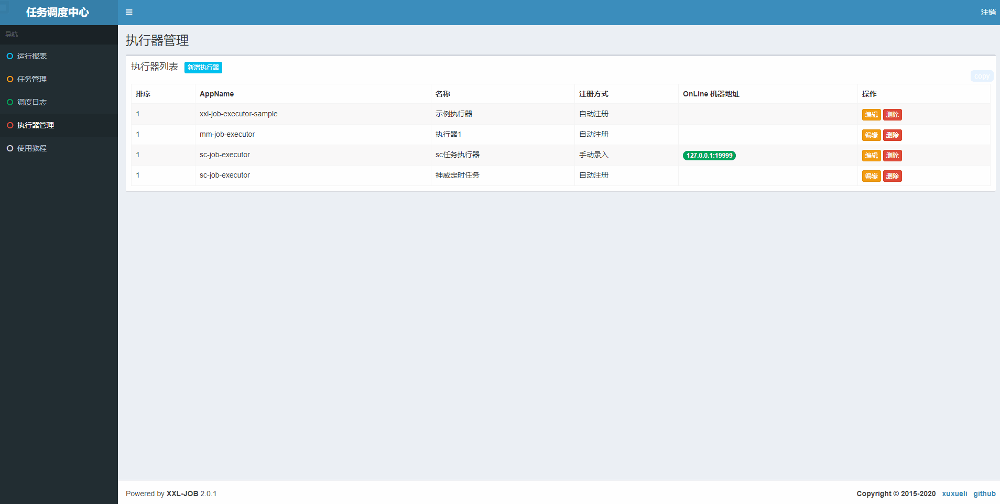
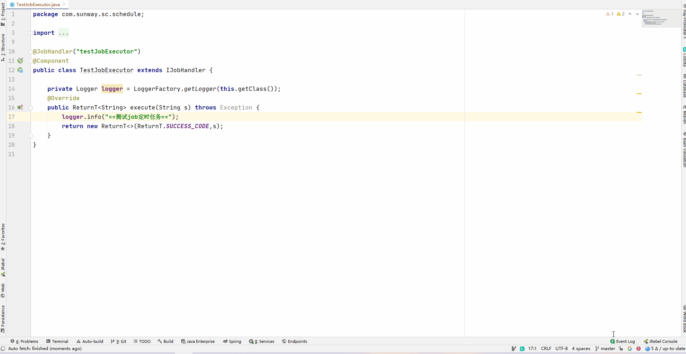
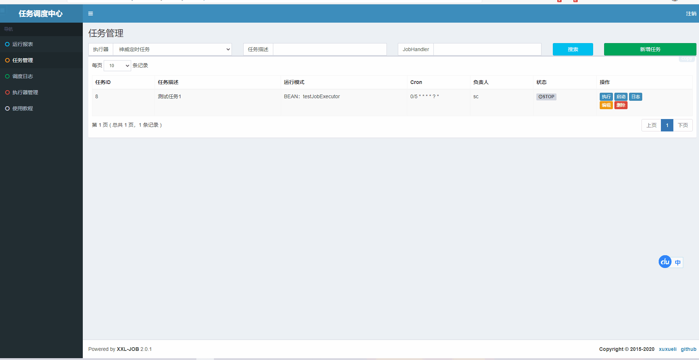

# xxl-job 分布式定时任务 

> 当前使用的xxl-job版本2.0.1，截至 `2020年9月24日` xxl-job 已更新至2.2.1

## 执行数据库脚本xxl-job.sql

路径在doc/sql/xxl-job.sql，其默认数据库名为xxl-job

## 启动SunWayJobAdminApplication

默认路径访问路径
```http://localhost:8080/xxl-job-admin```

### 登录界面

 

### 登录信息

用户：admin 

密码: 123456 

### 任务调度中心

 

## 系统配置

### 创建Job任务类

 

IJobHandler：Job任务类需要继承 `IJobHandler` 接口，其中接口中只有一个 `execute()`  方法，访问值必须是 `RenturnT<String>` ，参数的 `s` 可以从后台配置传入衔接业务。

@JobHandler：定时任务任务注解配置任务名，其中testJobExecutor为这任务类的名称

### 执行器组件配置类[XxlJobConfig](https://github.com/lingzhexi/xxl-job/blob/master/doc/config/XxlJobConfig.java)

 

> 修改为本地项目的组件扫描路径

### 创建注解[EnableJobExecute](https://github.com/lingzhexi/xxl-job/blob/master/doc/config/EnableJobExecute.java)

```java
@Target(ElementType.TYPE)
@Retention(RetentionPolicy.RUNTIME)
@Import(XxlJobConfig.class)
@Documented
@Inherited
public @interface EnableJobExecute {

}
```

在项目上添加该注解启动配置组件XxlJobConfig

 

### 配置job后台信息

```yml
#xxl-job分布式定时任务配置
xxl:
  job:
    admin:
      addresses: http://127.0.0.1:8080/xxl-job-admin
    executor:
      ip:
      port: 19999
      address:
      appname: sc-job-executor
      logpath: /data/applogs/xxl-job/jobhandler
      logretentiondays: -1
    accessToken:
```

adresses：定时任务的后台地址

port：系统定时任务调用端口

appname：执行器名称

> 更多配置信息参照：[执行器配置](https://www.xuxueli.com/xxl-job/#步骤二：执行器配置)

## 任务调度中心配置

### 创建执行器

1. 点击左侧菜单的执行器管理

2. 新增执行器

3. 输入配置信息

   AppName：系统配置文件里的appname，即sc-job-executor

   机器地址：系统的地址和端口号信息

   注册方式：分为两种自动注册和手动注册

   - 自动注册将会从系统配置信息获取地址和端口号
   - 手动注册需要配置系统的地址和端口号



### 创建Job任务

1. 点击左侧菜单的执行器管理

2. 新增执行器

3. 输入配置信息

   执行器：选择刚创建的执行器

   JobHandler：系统注解 `@JobHandler` 的任务名，即 `testJobExecutor`



> 更多配置参照：[Job任务创建](https://www.xuxueli.com/xxl-job/#步骤二：调度中心，新建调度任务)

### 执行任务

1. 断点 `testJobHandler` 

2. 点击左侧菜单的任务管理

3. 选择刚建执行器

4. 执行并输入参数

   ​	参数填不填均可，参数主要根据项目业务制定

5. 断点生效



### 查看日志

1. 点击日志
2. 点击查看

